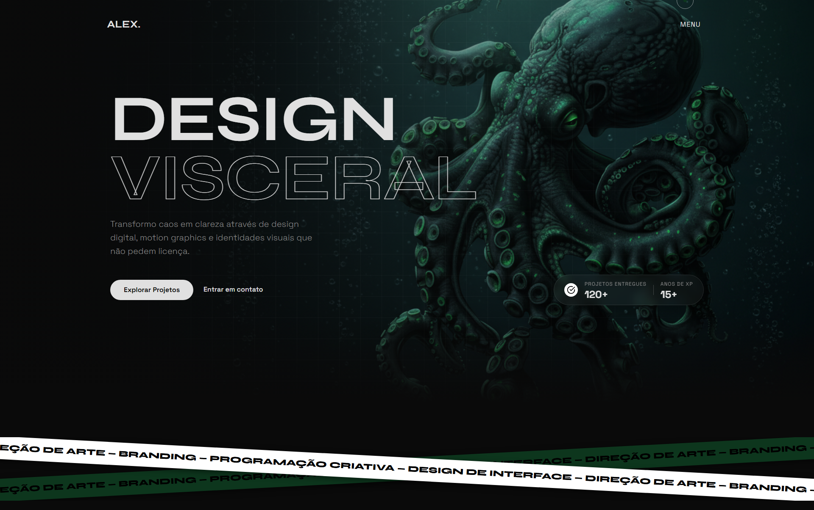

# ALEX | Visual Designer - Portfólio Profissional

Bem-vindo ao repositório do portfólio de **Alex | Visual Designer**. Este projeto foi desenvolvido com foco absoluto em **performance**, **acessibilidade** e **SEO**, utilizando práticas modernas de desenvolvimento web para entregar uma experiência fluida e impactante.

## 🚀 Sobre o Projeto

Este é um site estático (Landing Page) projetado para destacar trabalhos de design visual, direção de arte e branding. A interface é minimalista, "dark mode" por padrão, e utiliza animações sutis para criar uma navegação imersiva sem comprometer a velocidade de carregamento.

### Principais Características

*   **Performance Extrema**: Otimizado para atingir pontuação 90+ no Google Lighthouse.
*   **Acessibilidade (a11y)**: Navegação via teclado, contraste adequado e semântica correta.
*   **SEO Friendly**: Metatags completas, Open Graph e estrutura hierárquica de conteúdo.
*   **Design Responsivo**: Adaptável a qualquer dispositivo (Mobile-First).
*   **Animações Otimizadas**: Uso de CSS e JS leve para efeitos visuais sem bloqueio de renderização.

## 🛠️ Tecnologias Utilizadas

O projeto segue uma arquitetura limpa e sem dependências pesadas:

*   **HTML5 Semântico**: Estrutura clara e acessível.
*   **CSS3 Moderno**: Variáveis CSS, Flexbox, Grid e animações nativas.
*   **JavaScript (ES6+)**: Modular e focado em interações específicas (sem jQuery ou frameworks pesados desnecessários).
*   **Metodologia BEM**: Organização de classes CSS para manutenibilidade.

## 📦 Deploy

O projeto está pronto para ser hospedado em plataformas estáticas como **GitHub Pages**, **Vercel** ou **Netlify**.

1.  Suba o código para o GitHub.
2.  Conecte o repositório na sua plataforma de preferência.
3.  Configure o diretório de publicação (raiz).

## 🤝 Contribuindo

Sugestões e melhorias são bem-vindas! Sinta-se à vontade para abrir uma *issue* ou enviar um *pull request*.

---

Desenvolvido com 💜 e código limpo.
